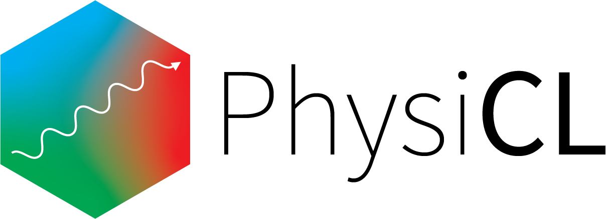

PhysiCL is a Python module for writing physics simulations that utilize OpenCL to accelerate calculations. It includes:

- A Numpy-based code units system
- A set of generic tools for writing simulations using pre-existing features, as well as writing your own features
- A collection of tools for writing simulations involving photons and scattering.

There are a number of Jupyter notebooks in the examples folder that highlight the usage of PhysiCL. PhysiCL is best suited for scenarios where it can be parallelized, namely those involving few interactions. 

#### Contributing

There are a number of ways you can contribute. Current tasks include:

- Improving the quality and coverage of the documentation.
- Improving the testing coverage.
- Fixing bugs.
- Adding new features
